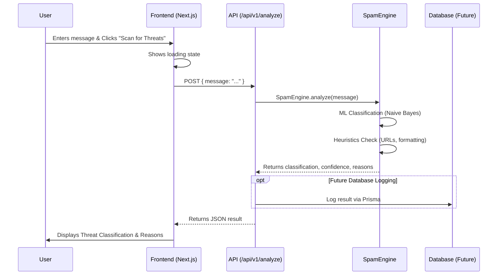

# TrustGate 🛡️

TrustGate is an intelligent gateway against spam, phishing, and toxic content. Built for modern developers and enterprise systems, it leverages a combination of Machine Learning (Naive Bayes) and advanced heuristics to provide real-time threat detection.

## 🚀 Features

- **AI-Powered Threat Detection:** Utilizes Natural Language Processing (NLP) with a Naive Bayes classifier to detect linguistic patterns of spam.
- **Advanced Heuristics:** Scans for high-risk links, IP-based URLs, and suspicious typography (e.g., excessive capitalization or special characters).
- **Real-Time Analysis API:** Exposes a fast Next.js API route to analyze messages on the fly.
- **Modern UI:** A sleek, responsive dashboard built with Next.js, Tailwind CSS, and Framer Motion.
- **Infrastructure Ready:** Includes a `docker-compose` setup for PostgreSQL and Redis to enable fast logging and caching.

## 📐 Architecture & Sequence Diagram

The following sequence diagram illustrates the flow of data when a user submits a message for analysis:



## 🛠 Tech Stack

- **Framework:** [Next.js](https://nextjs.org) (App Router)
- **Styling:** Tailwind CSS, Framer Motion, Lucide React
- **NLP Library:** [natural](https://github.com/NaturalNode/natural)
- **Database / ORM:** PostgreSQL, Redis, Prisma (configured via Docker Compose)

## 📊 Dataset

The Machine Learning model was trained on the [Spam Email Dataset](https://www.kaggle.com/datasets/jackksoncsie/spam-email-dataset) from Kaggle.

## 🏁 Getting Started

### Prerequisites

- Node.js 18.x or later
- Docker & Docker Compose (for database services)

### Installation

1. **Install dependencies:**
   ```bash
   npm install
   # or yarn install / pnpm install
   ```

2. **Start the background services (Postgres & Redis):**
   ```bash
   docker-compose up -d
   ```

3. **Run the development server:**
   ```bash
   npm run dev
   ```

4. **Open the App:**
   Visit [http://localhost:3000](http://localhost:3000) with your browser to see the live demo.

## 📡 API Reference

### POST `/api/v1/analyze`

Analyzes a text string for spam, phishing, or suspicious content.

**Request Body:**
```json
{
  "message": "Click here to win a free iPhone!"
}
```

**Response Example:**
```json
{
  "classification": "Spam",
  "confidence": 85,
  "threatScore": 8.5,
  "reasons": [
    "ML Model classified this text as Spam based on linguistic patterns.",
    "Found 1 URL(s). Links from untrusted sources are high-risk."
  ],
  "mlDetails": {
    "rawScore": 0.85,
    "normalizedConfidence": 85
  }
}
```

## 🤝 Contributing

Contributions are welcome! Please feel free to submit a Pull Request.

## 📄 License

This project is open-source and available under the [MIT License](LICENSE).
